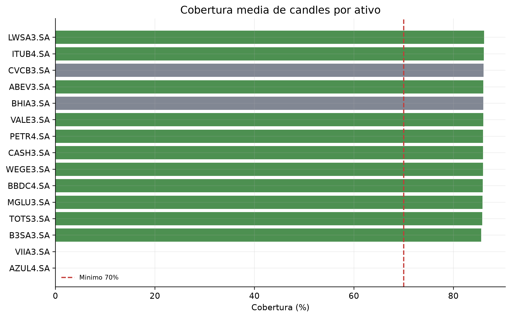
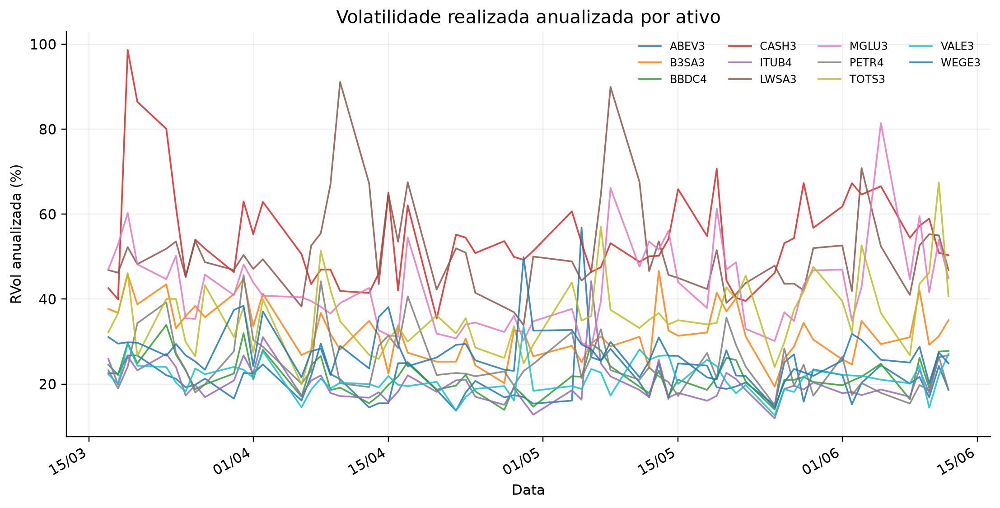
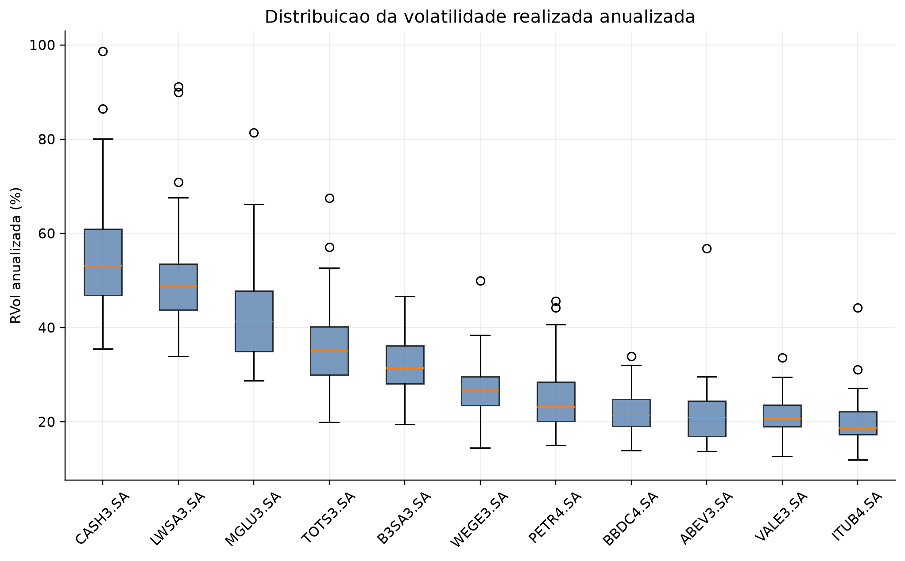
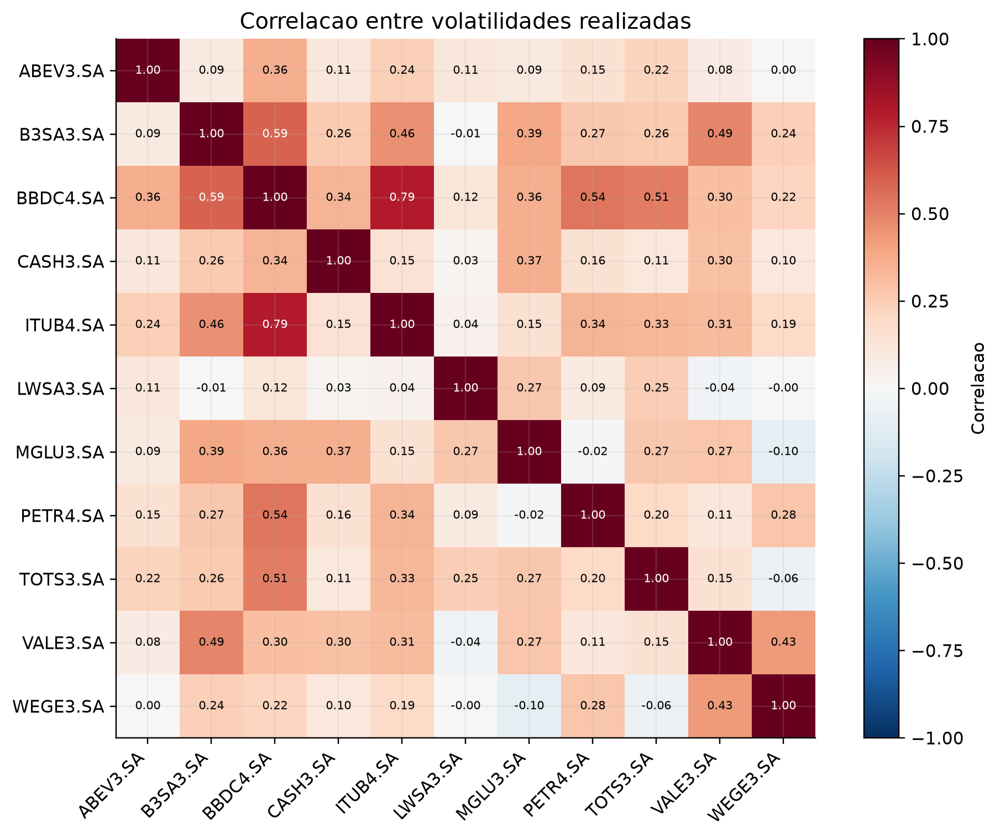
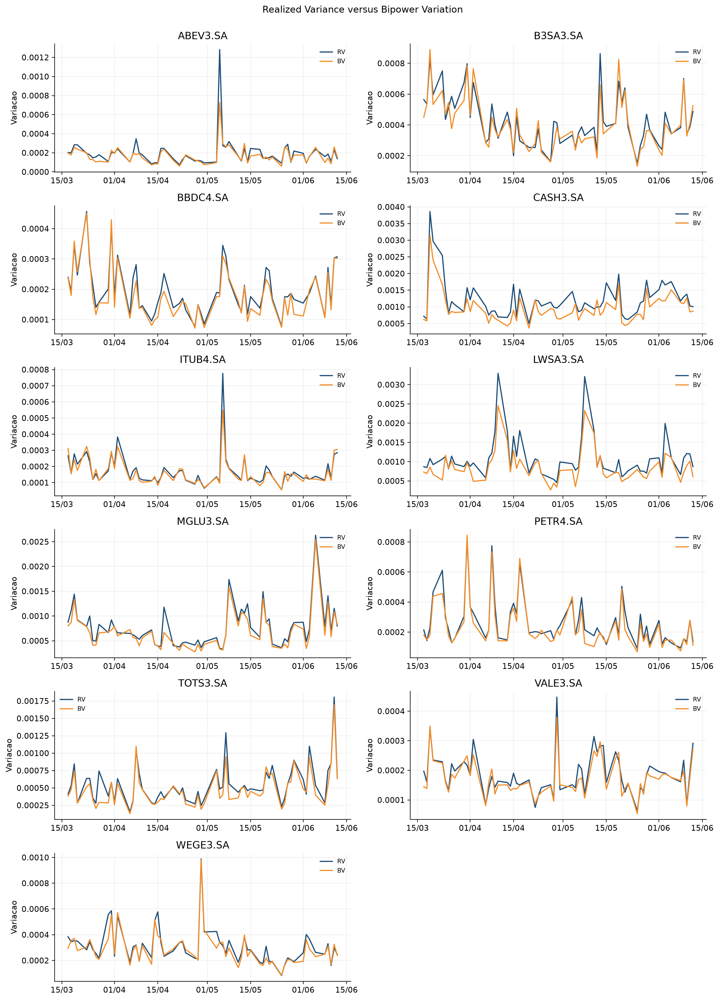
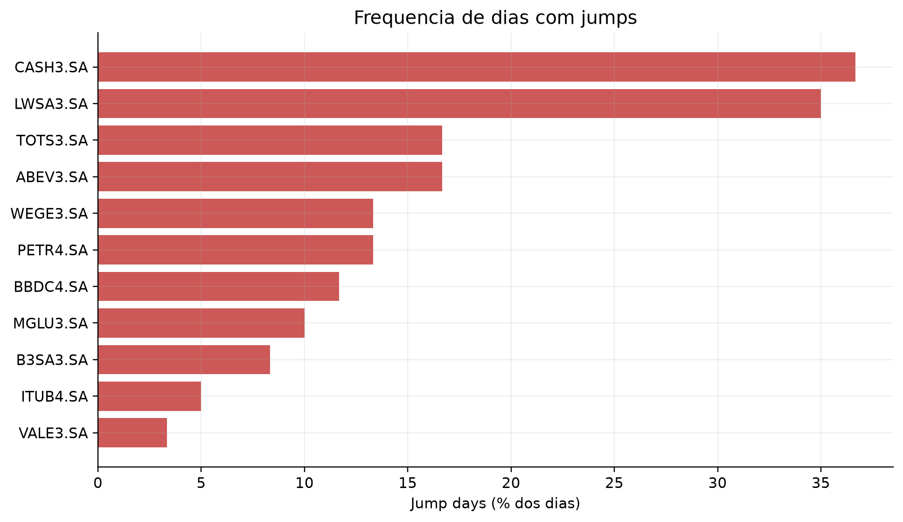
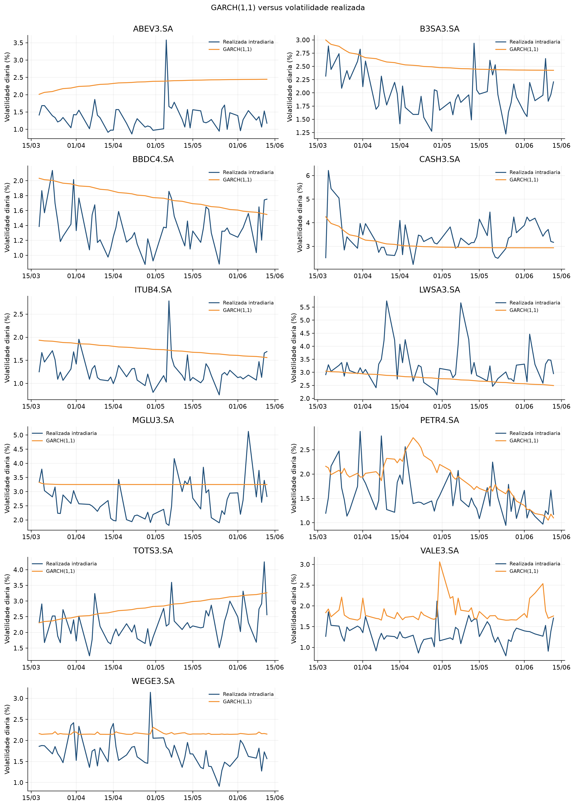
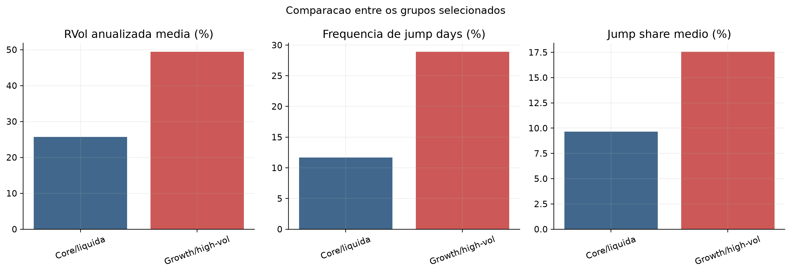
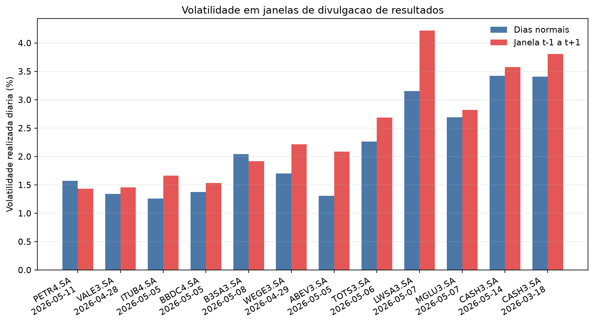

# Volatilidade Realizada com Dados Intradiarios: Evidencias para Acoes da B3

**Aluno:** Joao Paulo Zangrandi

**Instituicao:** FGV EESP

**Data de geracao:** 2026-06-14

## 1. Introducao

Este trabalho estima medidas de volatilidade realizada para acoes da B3 com dados intradiarios de cinco minutos. O objetivo e separar variacao continua e saltos, comparar ativos liquidos com candidatas growth/high-vol/small caps e discutir as consequencias para gestao de risco. A literatura de Andersen, Bollerslev, Diebold e Labys motiva o uso da soma dos retornos intradiarios ao quadrado como medida ex post da variabilidade diaria.

## 2. Dados

Os dados foram obtidos via `yfinance`, com `period="60d"` e `interval="5m"`. A amostra observada incluiu PETR4.SA, VALE3.SA, ITUB4.SA, BBDC4.SA, B3SA3.SA, WEGE3.SA, ABEV3.SA, TOTS3.SA, LWSA3.SA, MGLU3.SA, CASH3.SA. O Yahoo Finance limita o historico intradiario recente; portanto, os resultados descrevem uma janela curta e nao devem ser extrapolados mecanicamente para outros regimes.

## 3. Estrategia de amostra

A amostra principal liquida garante qualidade de dados e comparabilidade. A amostra complementar de acoes growth/small caps testa se ativos mais sensiveis a noticias, resultados e risco idiossincratico apresentam maior volatilidade realizada e maior frequencia/intensidade de jumps.

Foram exigidos pelo menos 30 dias validos, cobertura media minima de 70%, no minimo 40 retornos intradiarios por dia valido, precos positivos, volume positivo em parte relevante dos intervalos e proporcao de precos parados inferior a 50%.

### Tickers excluidos

- BHIA3.SA: precos parados 58.5% acima do maximo
- CVCB3.SA: precos parados 57.8% acima do maximo
- AZUL4.SA: download vazio
- VIIA3.SA: download vazio

## 4. Tratamento e construcao dos retornos

Os registros foram ordenados, desduplicados, convertidos para `America/Sao_Paulo` e restritos a 10:00-17:55. Cada ticker-dia foi sincronizado em grade regular de cinco minutos. O ultimo preco de cada intervalo foi usado; o forward-fill ocorreu apenas dentro do mesmo dia. O primeiro retorno de cada dia foi removido, evitando retornos entre o fechamento anterior e a abertura seguinte.

## 5. Metodologia

Para retornos intradiarios logaritmicos `r_k`, a realized variance e `RV = sum(r_k^2)` e a volatilidade realizada diaria e `sqrt(RV)`. A versao anualizada e `sqrt(252 RV)`.

A bipower variation usa produtos de retornos absolutos adjacentes e aproxima a variacao continua sob condicoes usuais. A jump variation e `JV = max(RV - BV, 0)`. O teste de jump combina RV, BV e tripower quarticity, classificando um dia quando a estatistica excede o quantil normal de 99%.

O GARCH(1,1) foi estimado com retornos diarios close-to-close em porcentagem. Essa serie inclui o componente overnight, ao contrario da RVol intradiaria; a comparacao e informativa, mas os objetos nao sao identicos.

## 6. Resultados de volatilidade realizada

O maior nivel medio de volatilidade realizada anualizada foi observado em **CASH3.SA**, com 54.4%. O ranking completo esta em `outputs/tables/asset_ranking_risk.csv`.

As series mostram variacao temporal e episodios de clustering. A matriz de correlacao permite avaliar se aumentos de risco ocorrem de forma comum ou idiossincratica, aspecto central para diversificacao.

## 7. Jumps

O ativo com maior frequencia estimada de jump days foi **CASH3.SA**, com 38.3%. A BV ajuda a separar a variacao continua da parcela associada a movimentos descontínuos. Em ativos menos liquidos, precos parados e negociacao esparsa podem distorcer essa separacao; por isso, os filtros de qualidade antecedem o teste.

## 8. GARCH

A persistencia mediana alpha + beta foi 0.942. Em geral, o GARCH representa persistencia e clustering por uma dinamica suavizada. A volatilidade realizada reage diretamente aos movimentos intradiarios e pode exibir picos mais abruptos em dias com saltos.

- ABEV3.SA: alpha+beta=0.942, correlacao GARCH-RVol=-0.055, status=ok.
- B3SA3.SA: alpha+beta=0.919, correlacao GARCH-RVol=0.455, status=ok.
- BBDC4.SA: alpha+beta=0.991, correlacao GARCH-RVol=0.163, status=ok.
- CASH3.SA: alpha+beta=0.869, correlacao GARCH-RVol=0.355, status=ok.
- ITUB4.SA: alpha+beta=0.993, correlacao GARCH-RVol=0.131, status=ok.
- LWSA3.SA: alpha+beta=0.993, correlacao GARCH-RVol=0.085, status=ok.
- MGLU3.SA: alpha+beta=0.502, correlacao GARCH-RVol=0.234, status=ok.
- PETR4.SA: alpha+beta=0.980, correlacao GARCH-RVol=0.285, status=ok.
- TOTS3.SA: alpha+beta=1.000, correlacao GARCH-RVol=0.297, status=ok.
- VALE3.SA: alpha+beta=0.355, correlacao GARCH-RVol=-0.041, status=ok.
- WEGE3.SA: alpha+beta=0.017, correlacao GARCH-RVol=0.114, status=ok.

## 9. Comparacao entre ativos liquidos e growth/small caps

O grupo complementar apresentou volatilidade realizada media maior: 49.4%, contra 25.7% no core (razao 1.92). A frequencia de jumps foi 28.9% no complementar e 11.7% no core.

PETR4 e VALE3 podem responder a petroleo, minerio, cambio e noticias globais; bancos refletem condicoes financeiras e risco domestico; tecnologia, consumo e growth tendem a ter maior sensibilidade a juros e revisoes de expectativas. Essas interpretacoes sao mecanismos economicos plausiveis, nao identificacao causal.

## 10. Eventos de resultados

Foram avaliados 12 eventos de earnings. Na media, a RVol da janela t-1/t/t+1 foi 16.7% maior que a media dos dias normais do mesmo ativo. A frequencia media de jump days foi 25.0% nas janelas, contra 17.8% nos dias normais. A comparacao e descritiva, usa datas de uma fonte terceirizada e nao identifica causalidade.

## 11. Implicacoes para gestao de risco

- VaR e expected shortfall baseados em distribuicoes suaves podem subestimar perdas em dias com jumps.
- RVol intradiaria oferece monitoramento mais rapido de mudancas no risco.
- Ativos com jump risk elevado justificam limites, margens e sizing mais conservadores.
- Correlacao entre volatilidades reduz o beneficio de diversificacao quando o risco sobe de forma conjunta.
- Baixa liquidez pode gerar ruido, precos parados e falsos sinais de salto.

## 12. Limitacoes

- Historico intradiario curto imposto pelo Yahoo Finance.
- Possivel ruido de microestrutura e ausencia de dados tick-by-tick.
- Sincronizacao por candles e forward-fill imperfeito.
- Resultados dependentes da frequencia de cinco minutos.
- Small caps podem ter negociacao esparsa ou ticker obsoleto.
- GARCH estimado com amostra diaria curta e incluindo retornos overnight.
- Eventos dependem de preenchimento manual e verificavel.

## 13. Conclusao

O projeto entrega uma pipeline reprodutivel que trata qualidade intradiaria antes de medir risco. Os resultados observados mostram que o ranking de risco, a frequencia de jumps e a persistencia GARCH sao dimensoes complementares. Para gestao de risco, a principal mensagem e que volatilidade continua, saltos e liquidez precisam ser avaliados conjuntamente.

Extensoes naturais incluem dados tick-by-tick da B3, comparacao entre 1, 5 e 15 minutos, HAR-RV, realized kernels, modelos com jumps explicitos e um calendario verificado de resultados e noticias.

## 14. Referencias

- Andersen, Bollerslev, Diebold e Labys (2003), realized volatility.
- Barndorff-Nielsen e Shephard (2004, 2006), bipower variation e testes de jumps.
- Bollerslev (1986), GARCH.
- Documentacao do pacote `arch`: https://bashtage.github.io/arch/
- Documentacao do `yfinance`: https://ranaroussi.github.io/yfinance/

## Checklist da Rubrica

1. **Tratamento e organizacao:** `data_download.py`, `data_cleaning.py`, `sample_selection.py`, scripts 01-03 e `data_coverage_by_ticker.csv`.
2. **Medidas:** RV, RVol e BV em `realized_measures.py`; resultados em `realized_measures.csv` e `realized_measures_summary.csv`.
3. **Jumps:** JV, tripower quarticity e teste em `jumps.py`; `jump_summary.csv` e figuras de jumps.
4. **Comparacao:** series, boxplot, ranking, correlacao e comparacao core versus growth/high-vol.
5. **Codigo:** pacote em `src/`, YAML, logs, tratamento de erros, testes e `run_all.py`.
6. **Analise:** interpretacao economica, conexao com teoria, GARCH e implicacoes para risco.
7. **Apresentacao:** relatorio Markdown, figuras em alta resolucao e PowerPoint de 18 slides.
